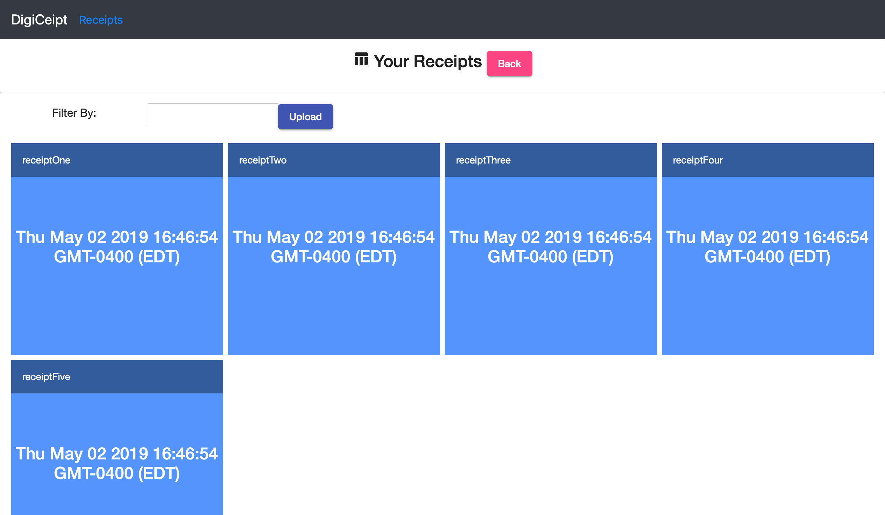

# DigiCeipt

### Purpose
Long gone are the days of struggling to store and keep track of physical receipts. Digiceipt acts as a a digital receipt storage solution to solve the issue of lost paper receipts.

### Technologies
The full-stack web application was developed using **Angular**, **NodeJS**, **MongoDB** and **Express**.

A **REST API** was developed using Express and Mongoose, implementing different HTTP verbs for data manipulation and storage.

**Angular** routing was incorporated to develop multiple views in an SPA, as well as user file upload to allow for the uploading of the receipt image.

The uploaded receipt image text was converted to digital text using **OCR** through the use of the **Google Cloud Vision API**, and then stored in **MongoDB**.

### Future Scope
The app is still currently under construction, but it won't be long before DigiCeipt comes to life!

### Views
#### Receipt View

